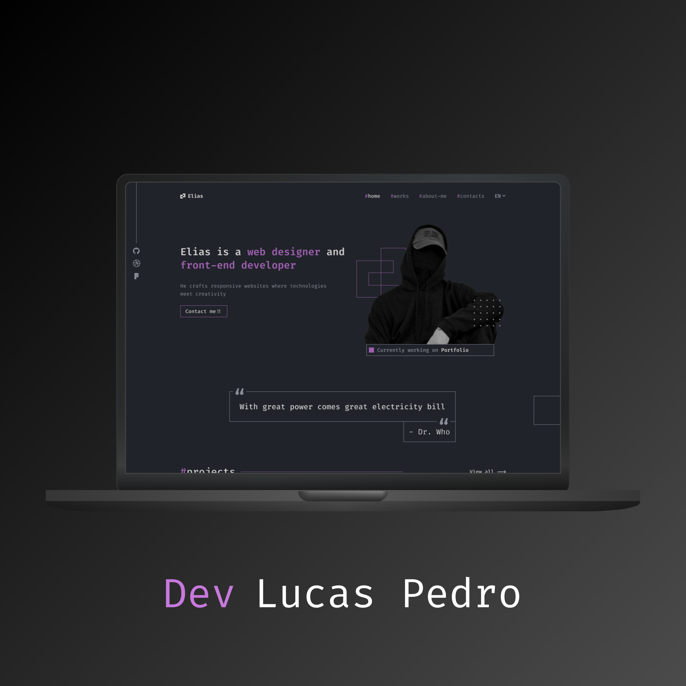

# Portfolio

Este projeto foi desenvolvido com **React**, **Vite** e **TypeScript**, com o objetivo de criar uma plataforma moderna e responsiva para mostrar suas habilidades, projetos e informações de contato.



## Visão Geral

O portfólio é dividido em várias seções que destacam diferentes aspectos do trabalho e experiência de Elias:

- **Hero Section:** Introduz Elias como desenvolvedor, destacando suas principais habilidades e seu trabalho atual.
- **Projects Section:** Apresenta projetos recentes desenvolvidos por Elias, com detalhes sobre cada um, incluindo as tecnologias utilizadas e links para visualização ao vivo.
- **Skills Section:** Lista as principais tecnologias e ferramentas com as quais Elias trabalha, incluindo linguagens, bancos de dados e frameworks.
- **About Me Section:** Uma breve biografia de Elias, detalhando sua experiência e abordagem ao desenvolvimento web.
- **Contacts Section:** Formas de entrar em contato com Elias para oportunidades de freelancing ou outras colaborações.

## Tecnologias Utilizadas

Este projeto foi construído usando as seguintes tecnologias:

- **React:** Biblioteca JavaScript para construir interfaces de usuário.
- **Vite:** Ferramenta de build rápida para desenvolvimento web moderno.
- **TypeScript:** Superset do JavaScript que adiciona tipagem estática ao código.
- **Styled-components:** Utilizado para estilização dos componentes com CSS-in-JS.

## Instalação e Execução Local

Para rodar o projeto localmente, siga as instruções abaixo:

### Pré-requisitos

- Node.js instalado em sua máquina (versão >= 14).
- npm ou yarn instalado.

### Passo a Passo

1. Clone o repositório:
  ```bash
   git clone https://github.com/LucasPedro123/portfolio-for-client
  ````

3. Instale as dependências:
  ```bash
   npm install
  ````
3. Inicie o servidor de desenvolvimento:
  ```bash
   npm run dev
  ````
4. Acesse o projeto em seu navegador
  ```bash
   http://localhost:5173
  ````

### Estrutura do Projeto

A estrutura do projeto segue uma abordagem modular para facilitar a escalabilidade e manutenção:

````bash
src/
│
├── assets/             # Arquivos estáticos (imagens, fontes, etc.)
├── components/         # Componentes reutilizáveis como Header, Card, Button
├── pages/              # Páginas principais do site, como Home
│   └── Home/
│       └── Sections/   # Seções específicas da página Home (Hero, Projects, About, etc.)
├── styles/             # Estilos globais
├── App.tsx             # Componente raiz
└── main.tsx            # Entrada do projeto
````

### Funcionalidades
Exibição de projetos em cards dinâmicos.
Seção de habilidades com as principais ferramentas e tecnologias.
Layout responsivo e adaptável para diferentes dispositivos.
Navegação entre seções utilizando hash links.

### Licença
Este projeto é licenciado sob a [MIT License]('https://github.com/LucasPedro123/portfolio-for-client?tab=MIT-1-ov-file').

### Contato
Se você deseja colaborar ou tem alguma dúvida, sinta-se à vontade para entrar em contato:

- Email: lucaspedrofernandes@gmail.com
- Discord: ordep_developer
bash